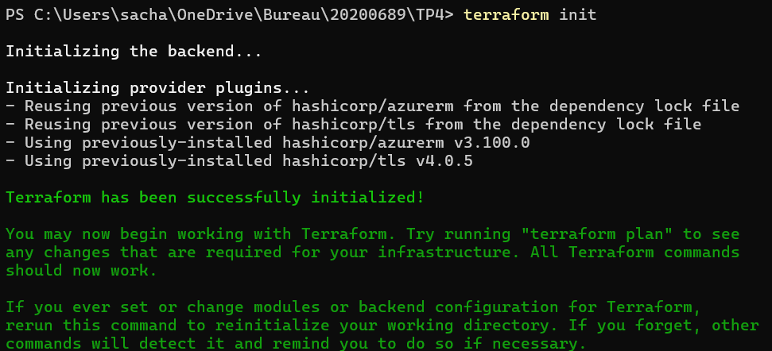
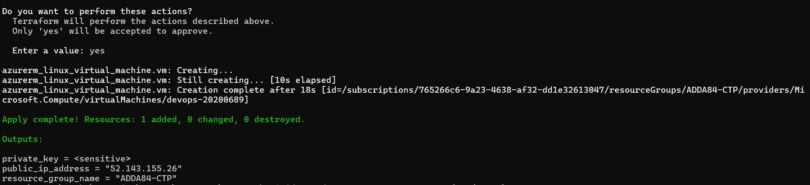
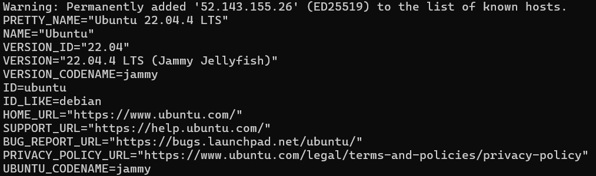

## Global context of the module

During various lab sessions, we will build a first a wrapper than an API which returns the weather forecast of a given location. 

Labs made in the context of a DevOps module, Efrei Paris, M1 Big Data and Machine Learning.

### TP1 

In this lab, we had to create a wrapper and a docker image associated for the weather reports. I chose to use nodejs, as I'm more used to manipulate APIs using JavaScript. The project therefore contains : 

- A `weather.js` file containing the GetWeather method, which calls the OpenWeather API using axios
- An `index.js` file to call the GetWeather method and return the forecast
- A Dockerfile to manage the dependencies of the docker image

The image was built using node:alpine3.19. 

**There was initially a .env file to store environment variables, but it's not needed for lab one considering that the instructions want the variables to be parsed as arguments.**

Main difficulty of the project : making sure that the image had no vulnerability. The only vulnerability left in my image is the CVE-2024-28863. The issue surfaced very recently and the fixing solution provided by Docker (updating tar to the latest version) doesn't seem to work. However, using the following lines in the dockerfile seemed to fix all the issues regarding vulnerabilities : 

```
RUN npm install -g npm@10.5.2 && npm cache clean --force

RUN apk update && apk upgrade && apk add --no-cache openssl
```


To run the code, use `docker run --env LAT="wanted_lat" --env LONG="wanted_long" --env API_KEY=**** weather-wrapper`

This will return something like this : 


Link to the docker image from dockerhub : https://hub.docker.com/r/sachalunae/weather-wrapper 

### TP2

The second lab aim was to transform the wrapper into an API and use github actions/workflows to automatise the dockerhub push process while committing on git.

Accordingly, a workflow has been added in the repository (`actions.yml`) :
- It's triggered when pushing on the main branch or making a pull request from the main branch.
- Build hadolint, which prevents warnings and errors from being pushed
- Lints docker file and does all the job required to build and push the docker image

The `index.js` file has also been changed in order to use express.js. **IMPORTANT : the port used is the port 3000.** You can use the following docker run command to start the server via docker : 
- For windows : `docker run -p 3000:3000 --env API_KEY=your_api_key sachalunae/weather-wrapper:latest`
- For linux : `docker run --network host --env API_KEY=your_api_key sachalunae/weather-wrapper:latest`

You can also start the server using `node index.js`. **IMPORTANT : you should use a .env file with `API_KEY = your_api_key`.** It's encapsulated in the gitignore.

Once it's done, use `curl "http://localhost:3000/weather?lat=5.902585&lon=102.754175"`to fetch the wanted data. *The url isn't the exact same as wanted in the TP2, you need to add 'weather'*

You'll get the following output : 


The link to the docker image is the same : https://hub.docker.com/r/sachalunae/weather-wrapper 

The main difficulty of the project to me was making sure that all the versions of each package was compatible with each-other. Hence the few failed committing attempts before having a project which completely works. There was also some hadolint warnings in the beginning that prevented the push from happening (but that's what hadolint is about!).


### TP3 

The third lab aim was to put the API image to disposal on an Azure Container Register (ACR) using github actions.

The workflow (`actions.yml`) has been changed accordingly, using the credential provided in GitHub secrets.

**Use the API through the following link : `http://20200689.francesouth.azurecontainer.io:3000/weather?lat=5.902785&lon=102.754478` !don't forget the port and the 'weather'!**

You'll get the following output : 


The main difficulty of the project was making sure that small details were okay, such as the encryption of the API key or the name of the image : 


### TP4

The fourth and final lab aim was to use terraform to create an Azure Virtual Machine with a public address in an existing network.

A new folder `TP4` has been added accordingly to the repository. It contains 3 terraform files : main.tf (which also contains the providers), outputs.tf to print certain variables after the `terraform apply` and variables.tf which stores certain variables needed for the project : the name of the ressource group, the location, etc.

The main.tf file, in addition to the providers (azure and tls), contains 3 data (already existing resources which we call) and 4 resources : 
- data "azurerm_resource_group"
- data "azurerm_virtual_network"
- data "azurerm_subnet"
- resource "azurerm_public_ip"
- resource "azurerm_network_interface"
- resource "azurerm_linux_virtual_machine"
- resource "tls_private_key"

Additionnal note : the command `terraform fmt` was used to unsure a correct formatting of all files.

#### Running everything : 
Use `cd TP4` to access the terraform files. Then `terraform init` and `terraform apply` which will create in the azure ressource group : 
- A virtual machine
- A disk
- A network interface
- A public IP address





You can verify the good functionning of everything using the command `ssh -i id_rsa devops@{PUBLIC_ADDRESS_IP} cat /etc/os-release` **IMPORTANT : make sure to replace "PUBLIC_ADDRESS_IP" with the address that the console returns after the terraform apply, unless you have the correct environment variables.**



#### Difficulties faced : 

The main difficulty to me was starting the lab, I wasn't sure of the steps I had to do and I didn't want to cause any damage since I didn't know my exact permissions. Afterwards, I had small issues with understanding what to call data and what to call resource on my main. Once that was sorted, the lab was easier.